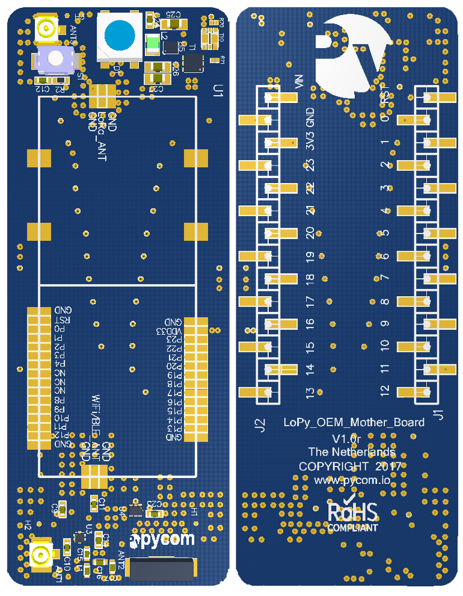

.. _datasheets:

****************
5. Datasheets
****************

This section contains all of the datasheets for our devices. This includes pinouts and schematics (for certain devices).

.. include:: datasheets/wipy2.rst

.. include:: datasheets/lopy.rst

.. include:: datasheets/sipy.rst

.. include:: datasheets/pysense.rst

.. include:: datasheets/pytrack.rst

OEM baseboard reference design
------------------------------

Our OEM baseboard reference design with schematic and layout are available `here <../_downloads/OEM-baseboard-schematic.pdf>`_ and `here <../_downloads/OEM-baseboard-layout.pdf>`_.

The complete Altium project and Gerber files are available on `this link <../_downloads/OEM_Baseboard_reference_design.zip>`_.

.. include:: datasheets/expansionboard.rst

:download:`PDF file hidden <downloads/exp_v03_pinout_v13.pdf>`
:download:`PDF file hidden <downloads/expansionBoard2SpecsheetGraffiti.pdf>`
:download:`PDF file hidden <downloads/lopy_pinout.pdf>`
:download:`PDF file hidden <downloads/lopySpecsheetGraffiti.pdf>`
:download:`PDF file hidden <downloads/l01SpecsheetGraffitiOEM.pdf>`
:download:`PDF file hidden <downloads/Sipy_v01_1_pinout_rc.pdf>`
:download:`PDF file hidden <downloads/sipySpecsheetGraffiti.pdf>`
:download:`PDF file hidden <downloads/s01SpecsheetGraffitiOEM.pdf>`
:download:`PDF file hidden <downloads/wipy_pinout.pdf>`
:download:`PDF file hidden <downloads/wipy2SpecsheetGraffiti.pdf>`
:download:`PDF file hidden <downloads/w01SpecsheetGraffitiOEM.pdf>`
:download:`PDF file hidden <downloads/OEM-baseboard-layout.pdf>`
:download:`PDF file hidden <downloads/OEM-baseboard-schematic.pdf>`
:download:`PDF file hidden <downloads/WiPy-OEM-Drawings.pdf>`
:download:`PDF file hidden <downloads/LoPy-OEM-Drawings.pdf>`
:download:`PDF file hidden <downloads/Deep-Sleep-Shield_Schematic.pdf>`
:download:`PDF file hidden <downloads/OEM_Baseboard_reference_design.zip>`

.. raw:: html

    

Deep Sleep Shield Schematic
---------------------------

The Deep sleep shield schematic is available on this `link <../_downloads/Deep-Sleep-Shield_Schematic.pdf>`_.

5.7 Powering with an external power source
==========================================

The modules can be powered by a battery or other external power source.

**Be sure to connect the positive lead of the power supply to VIN, and
ground to GND.**

- When powering via ``VIN``:

   **The input voltage must be between 3.4V and 5.5V.**

- When powering via ``3V3``:

   **The input voltage must be exactly 3V3, ripple free and from a supply capable
   of sourcing at least 500mA of current**

The battery connector for the expansion board is a **JST SH 2P** variant. The expansion board exposes the male connector and an external battery should use a femail adapter in order to connect and power the expansion board.

.. warning::

   The GPIO pins of the modules are NOT 5V tolerant, connecting them to voltages higher
   than 3.3V might cause irreparable damage to the board.

.. warning::
    Static electricity can shock the components on the module and destroy them. If you experience a lot of static electricity
    in your area (eg dry and cold climates), take extra care not to shock the module.  If your module came in a ESD bag, then
    this bag is the best way to store and carry the module as it will protect it against static discharges.
