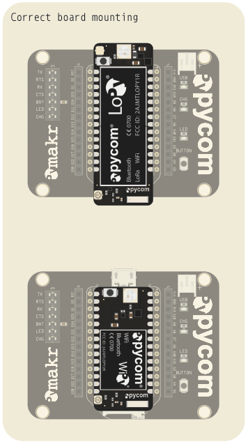
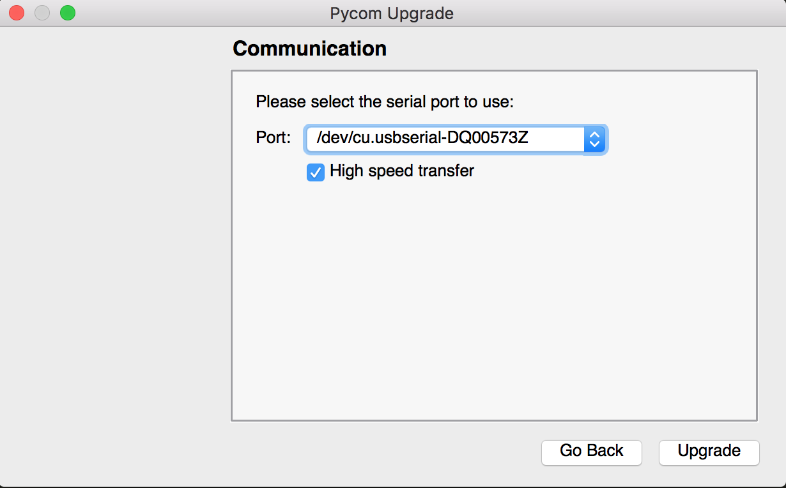
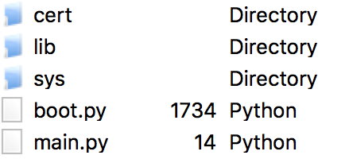
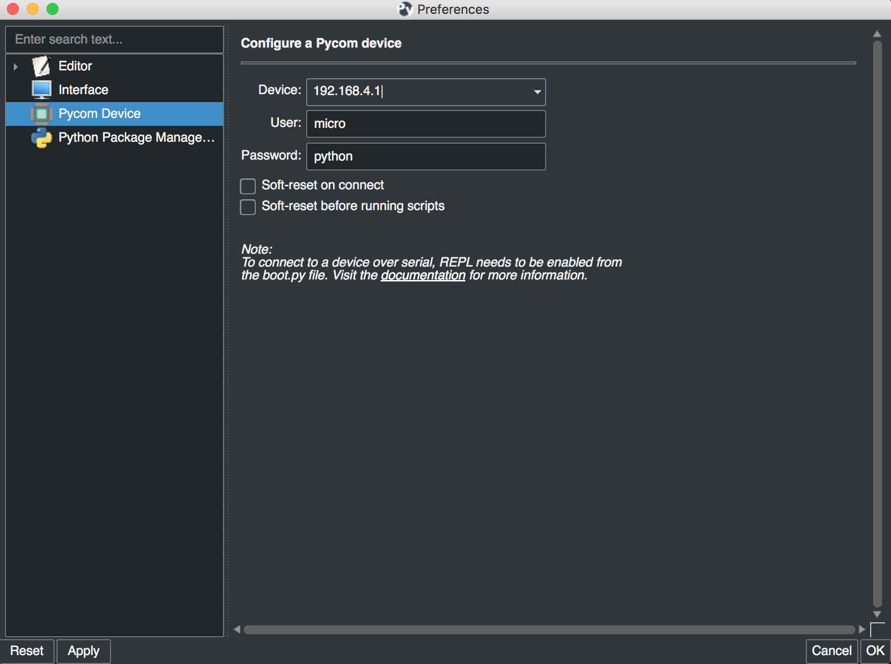
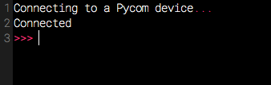
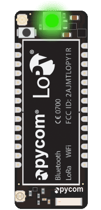

***************************
1. Quickstart guide
***************************

Let's start with a quick description of what to do after you unpack your brand
new toy. Our aim is not to bug you with complex details about it, but instead
get you as quick as possible to the point you can start doing useful things
with your device.

It is strongly recommended to update the firmware on your device before coding, this is described in section 1.3 below

This chapter will get you unboxed and ready to code in no time.

- :ref:`Unboxing and the expansion board <unboxing>`
- :ref:`Connecting over USB <connecting_over_usb>`
- :ref:`Firmware Upgrades <firmware_upgrades>`
- :ref:`Micropython introduction <micropython_intro>`
- :ref:`Connecting the board and coding using Pymakr <connecting_using_pymakr>`

If anyting goes wrong, there is a :ref:`Troubleshooting` section that addresses the most common issues. In case of any doubts you can always ask questions in our `community forum <http://forum.pycom.io>`_.

.. _unboxing:

1.1 Unboxing and the expansion board
================================

The only way to learn how to use something new is by doing. First, we need to
put together the basic pieces:

1. Look for the reset button on your module (located at a corner of the board).
2. Look for the USB connector on your expansion board.
3. Insert the module on the expansion board with the reset button pointing in the same direction as the USB connector.

It's that simple! If you want to confirm your work, here's a picture showing
how to place your board properly on the expansion board:

If you prefer video tutorials, here is a
`video <https://www.youtube.com/embed/wUxsgls9Ymw>`_ showing these steps.
It applies to all our modules.

.. raw:: html

    

    <object style="margin:0 auto;" width="480" height="385"><param name="movie"
    value="https://www.youtube.com/v/wUxsgls9Ymw"></param><param
    name="allowFullScreen" value="true"></param><param
    name="allowscriptaccess" value="always"></param><embed
    src="http://www.youtube.com/v/wUxsgls9Ymw"
    type="application/x-shockwave-flash" allowscriptaccess="always"
    allowfullscreen="true" width="480"
    height="385"></embed></object>
    

.. note::

    Some modules like the LoPy will be big enough to cover the USB connector. 
    This is normal as long as you keep the orientation as shown.

To extend the life of your expansion board, please be aware of the following:

  - Be gentle when plugging/unplugging the USB cable.  Whilst the USB connector
    is well soldered and is relatively strong, if it breaks off it can be very
    difficult to fix.

  - Static electricity can shock the components on the device and destroy them.
    If you experience a lot of static electricity in your area (eg dry and cold
    climates), take extra care not to shock the device.  If your device came
    in a ESD bag, then this bag is the best way to store and carry the
    device as it will protect it against static discharges.

Expansion board hardware guide
------------------------------

The document explaining the hardware details of the expansion board can be found
`here <https://github.com/WiPy/WiPy/blob/master/docs/User_manual_exp_board.pdf>`_.

The pinout for the expansion board can be found in chapter :ref:`datasheets`

.. _connecting_over_usb:

1.2 Connecting over USB
=======================

Once you’re sure everything is in place, the fun begins. It is time to turn
your device on. Just plug it into any powered USB cable (your computer or a
battery charger).

In a few seconds, the LED should start blinking every 4 seconds. This means
that everything is fine! If you cannot see the blinking, please disconnect the
power supply and re-check the boards position on the expansion board.

.. image:: images/blinking.gif
    :alt: LED blinking
    :align: center
    :scale: 60 %

.. _firmware_upgrades:

1.3 Firmware Upgrades
=====================

We **strongly recommend** you to upgrade your firmware to the latest version
as we are constantly making improvements and adding new features.

Here are the download links to the update tool. Please download the appropriate
one for your OS and follow the instructions on the screen.

- `Windows <https://software.pycom.io/findupgrade?product=pycom-firmware-updater&type=all&platform=win32&redirect=true>`_.
- `MacOS <https://software.pycom.io/findupgrade?product=pycom-firmware-updater&type=all&platform=macos&redirect=true>`_ (10.11 or higher).
- `Linux <https://software.pycom.io/findupgrade?product=pycom-firmware-updater&type=all&platform=unix&redirect=true>`_ (requires dialog package).

Previous versions of firmware are available for download on the `Pycom website 
<https://www.pycom.io/support/supportdownloads/#firmware>`_. 

The instructions given by the updater tool should be followed carefully. The basic 
procedure is like this:

- Disconnect your device from the PC.
- Connect wire G23+GND using a jumper cable.
- Connect the board to the USB.
- Run the upgrader
- Remove the G23+GND wire.
- Reboot the device (button or powercycle)

Connecting G23 and GND puts the device in 'update mode'. You won't need this for any 
other task than using the firmware upgrader.

After you’re done with the upgrade, you can :ref:`use Pymakr <pymakr>` to upload and run
programs in your device.

If you have your telnet connection or Pymakr already setup, the version can be  with the 
following code:

::

    import os
    os.uname().release

.. warning::

    Make sure the TX jumper is present on your expansion board, as the jumpers sometimes 
    come loose in the box during transport. Without this jumper, the updater will fail.

.. _micropython_intro:

1.4 Micropython Introduction
============================

Our boards work with `Micropython <https://micropython.org/>`_; a Python 3 implementation 
that is optimised to run on micocontrollers. This allows for much faster and easier 
development than using C. 

When booting, two files are executed automatically: first boot.py and then main.py. These 
are placed in the /flash folder on the board. Any other files or libraries can be placed 
here as well, and included or used from boot.py or main.py. 

The folder structure in /flash looks like the picture below. The files can be managed either 
using :ref:`FTP <pycom_filesystem>` or using :ref:`Pymakr <pymakr_ide>`.

.. _connecting_using_pymakr:

1.5 Connecting your board using Pymakr
=====================================

To make it as easy as possible, we developed Pymakr, a tool that will allow you
to connect to and program your Pycom devices. We’re going to use it in this
section to give you a quick taste of how you can work with your device. You can
download Pymakr from `here <https://www.pycom.io/solutions/pymakr/>`_.

More extended info on pymakr like how to use the pycom console and the expert
interface can be found under :ref:`Tools & Features <pymakr_ide>`

.. note::
    If you have any trouble connecting over USB using pymakr, make sure you have the 
    proper `FTDI drivers <http://www.ftdichip.com/Drivers/D2XX.htm>`_ installed.

Initial configuration
---------------------

After installing Pymakr, you need to take a few seconds to configure it for the
first time. Please follow these steps:

    1. Connect your computer to the WiFi network named after your board (e.g. ``lopy-wlan-xxxx``, ``wipy-wlan-xxxx``). The password is ``www.pycom.io``
    2. Open Pymakr.
    3. In the menu, go to ``Settings > Preferences`` (``Pymakr > Preferences`` on macOS).
    4. In the left list look for Pycom Device.
    5. For device, type down ``192.168.4.1``. The default username and password are ``micro`` and ``python``, respectively.
    6. Click OK

.. note::
    Pymakr also supports wired connections. Instead of typing the IP address, you
    can click on the combo box arrow and select the proper serial port from the list.
    Our boards don’t require any username or password for the serial connection, so you
    can leave those fields empty.

That’s it for the first time configuration. In the lower portion of the screen,
you should see the console, with the connection process taking place. At the
end of it, you’ll get a 'connected' message and a colored ``>>>`` prompt,
indicating that you are connected:

`There is also a video <https://www.youtube.com/embed/bL5nn2lgaZE>`_ that explains
these steps on macOS (it is similar for other operating systems).

.. raw:: html

    

    <object style="margin:0 auto;" width="480" height="385"><param name="movie"
    value="https://www.youtube.com/v/bL5nn2lgaZE"></param><param
    name="allowFullScreen" value="true"></param><param
    name="allowscriptaccess" value="always"></param><embed
    src="http://www.youtube.com/v/bL5nn2lgaZE"
    type="application/x-shockwave-flash" allowscriptaccess="always"
    allowfullscreen="true" width="480"
    height="385"></embed></object>
    

Creating a project
------------------

Pymakr has a feature to sync and run your code on your device. This is mostly done using projects. The following steps will get you started.

- In Pymakr, go to Project > New project.
- Give it a name and select a folder for your project, either a new of existing one.
- Create two files: main.py and boot.py, if you don't already have those.

.. note::
    You can also :ref:`use FTP <pycom_filesystem>` to download boot.py and main.py from the board to your project folder, after which you can right-click the project viewer and use the 'add source files' option to add them to your project.

The boot.py file should always have the following code on the top, so we can run our python scripts over serial or telnet. All of our newer boards have this code already in the boot.py file.

.. code:: python

    from machine import UART
    import os
    uart = UART(0, 115200)
    os.dupterm(uart)

Most users, especially WiPy users, would want a wifi script in the boot.py file. A basic wifi script but also more advanced WLAN examples, like fixed IP and multiple networks, can be found in the :ref:`Wifi Examples <wlan_step_by_step>` chapter.

Besides the neccesary main.py and boot.py files, you can create any folders and python files or libraries that you want to include in your main file. Pymakr will synchronize all files in the project to the board when using the sync button.

.. Warning::

    When synchronizing your project to the board, make sure the REPL console is ready. If any programs are running or the board is still booting, synchronization might fail.

Without creating a project
--------------------------

If you just want to test some code on the module, you can create a new file or open an existing one and press the 'run' button.

.. Warning::

    The changes you make to your file won't be automatically saved to the device on execution.

Coding basics
-------------

For fun, lets try again to build a traffic light. Add the following code to the main.py file:

::

    import pycom
    import time
    pycom.heartbeat(False)
    for cycles in range(10): # stop after 10 cycles
        pycom.rgbled(0x007f00) # green
        time.sleep(5)
        pycom.rgbled(0x7f7f00) # yellow
        time.sleep(1.5)
        pycom.rgbled(0x7f0000) # red
        time.sleep(4)

- Make sure the connection to your board is open in the Pycom Console
- Press the sync button on the top toolbar. Any progress will be shown in the console.

Here is the expected result:

You now have a traffic light in your hands! To stop a running program, use ctrl-c or do a right click
on the console and press ``Reset``. You can also reboot the board by
pressing the physical reset button.

.. Warning::
    If your board is running code at boot time, you might need to boot it in :ref:`safe mode <safeboot>`.
