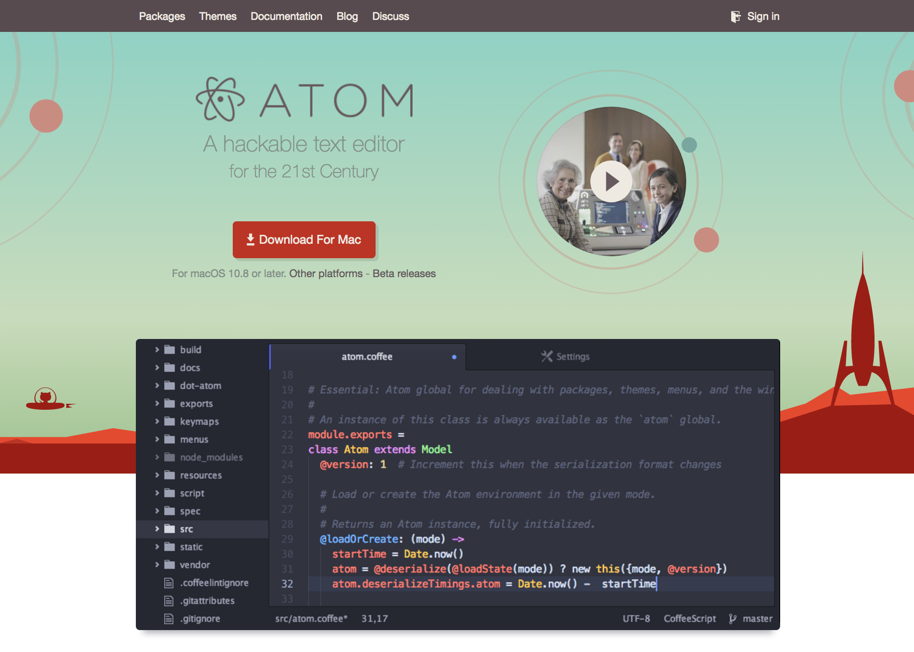
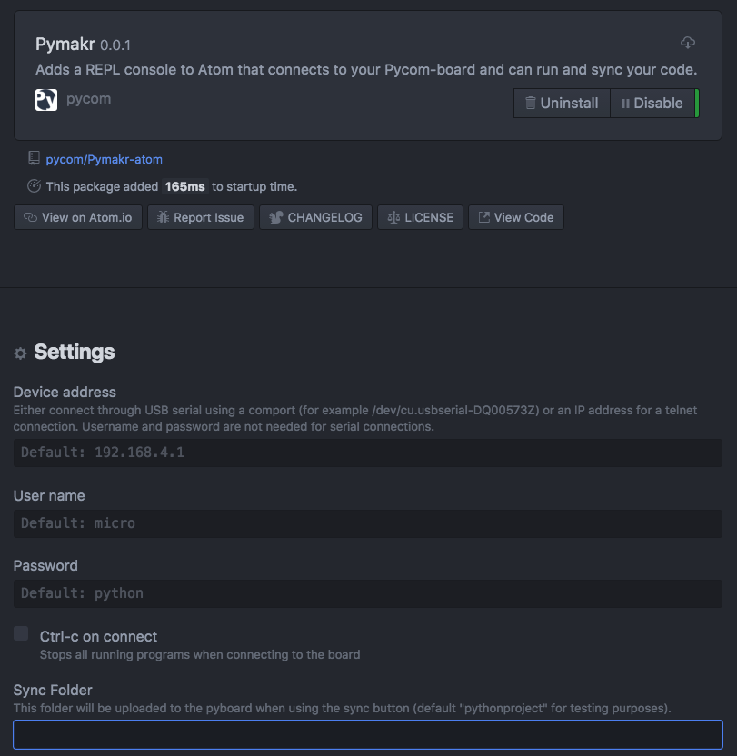
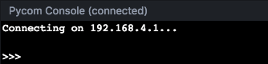
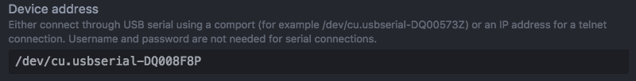
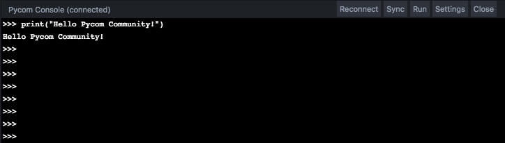
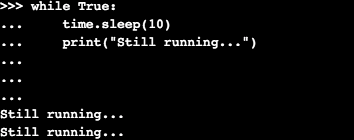

2.7 Pymakr Plugin
=================

Here are some basic tips on how to use the Pymakr Plugin to upload code to your devices. This guide is generic for all of our Plugins (Atom, Sublime, etc.) but the images in this chapter will refer to the Atom text editor.

Supported Editors/IDEs:

- `Atom <https://atom.io/>`_
- `Sublime <https://www.sublimetext.com/>`_
- `Visual Studio Code <https://code.visualstudio.com>`_
- `PyCharm <https://www.jetbrains.com/pycharm/>`_

Drivers (FTDI):

- `FTDI driver <http://www.ftdichip.com/Drivers/D2XX.htm>`_

.. note::

	Currently a number of these plugins are under development and may not be available at this time. Pycom is launching the plugin for Atom initally and following up with other platforms as inital releases are completed.

Installing Pymakr Plugin (Atom)
-------------------------------

For beginners, users getting started with MicroPython & Pycom as well as Atom text editor users, we recommend the **Pymakr Plugin for Atom**. This section will help you get started using the `Atom text editor <https://atom.io>`_ & `Pymakr Plugin <https://atom.io/packages/pymakr>`_.

Please follow these steps to install the Pymakr Plugin:

	1. Ensure that you have `Atom <https://atom.io/>`_ installed and open.
	2. Navigate to the ``Install`` page, via ``Atom > Preferences > Install``
	3. Search for ``Pymakr`` and select the official Pycom Pymakr Plugin.
	4. You should now see and ``Install`` button. Click this to download and install the Pymakr Plugin.
	5. That's it! You've installed the Pymakr Plugin for Atom.

Initial Configuration (Atom)
----------------------------

After installing the Pymakr Plugin, you need to take a few seconds to configure it for the
first time. Please follow these steps:

    1. Ensure that your Pycom board is turned on and connected.
    2. Connect your computer to the WiFi network named after your board (e.g. ``lopy-wlan-xxxx``, ``wipy-wlan-xxxx``). The password is ``www.pycom.io``
    3. Open Atom and ensure that the Pymakr Plugins are installed.
    4. In the menu, go to ``Atom > Preferences > Packages > Pymakr``.
    5. By default, the Address should be listed as ``192.168.4.1``. If not, change this to ``192.168.4.1``.
    6. The default username and password are ``micro`` and ``python``, respectively.
    7. You settings will be saved automatically.

That’s it for the first time configuration. In the lower portion of the screen,
you should see the console, with the connection process taking place. At the
end of it, you’ll get a 'Connecting on 192.168.4.1...' message and a ``>>>`` prompt,
indicating that you are connected:

Connecting via USB Serial
-------------------------

In order to use the Pymakr Plugin with a Pycom device, connected via USB Serial, a couple of settings need to be adjusted. Below are the steps required to find, set and connect to your Pycom device over USB Serial.

To determine the serial address in which your Pycom device is connected, you will need to scan for connected devices on your computer.

Mac OS
^^^^^^

Open up your ``terminal`` and type the following command:

::

 $ ls /dev/cu.*

This will print out all of the devices connected to your Mac via the USB serial port. If you are using an expansion board, it should appear in a similar format to this ``/dev/cu.usbserial-XXXXXXXX``.

Linux
^^^^^

Open up your ``terminal`` and type the following command:

::

 $ ls /dev/serial/

This will print out all of the devices connected to your Linux computer via the USB serial port. If you are using an expansion board, it should appear in a similar format to this ``/dev/cu.usbserial-XXXXXXXX``.

Windows
^^^^^^^

Open your ``Start Menu`` and type ``Device Manager``. This will open a tool that lists all of the peripherals (connected devices) on your computer. Navigate to ``Ports`` and unfold the dropdown. You should see a device listed as something similar to ``USB Device (COM 4)``. Depending on what you have connected to your machine, the COM Port and name may vary.

.. note::

	You can also find this via ``Control Panel > Device Manager > Ports``.

Once you've worked out what your Pycom device is listed/named, you can add this to the Pymakr Plugin Settings:

Creating a Project
------------------

The Pymakr Plugins have a feature to sync and run your code on your device. This can be used for both uploading code to your device as well as testing out scripts by running them live on the device. The following steps will get you started.

- In Atom, go to File > Add Project Folder.
- Create a new folder within the prompt and give it a name. Then select `open` to initialise this as a project folder. You may also use an existing folder if you choose.
- Create two files: main.py and boot.py, if you don't already have those.

.. note::
    You can also :ref:`use FTP <pycom_filesystem>` to download boot.py and main.py from the board to your project folder. This is commonly used when copying large numbers of files to a Pycom board.

The boot.py file should always start with following code, so we can run our python scripts over Serial or Telnet. Newer Pycom boards have this code already in the boot.py file.

::

    from machine import UART
    import os
    uart = UART(0, 115200)
    os.dupterm(uart)

Many users, especially the WiPy users, will want a WiFi script in the boot.py file. A basic WiFi script but also more advanced WLAN examples, like fixed IP and multiple networks, can be found in the :ref:`WiFi Examples <wlan_step_by_step>` chapter. The script below connects to your network and prints out your device's local IP address.

::

    from machine import UART
    import os
    uart = UART(0, 115200)
    os.dupterm(uart)

    wlan = WLAN(mode=WLAN.STA)
    wlan.scan()

    wlan.connect(ssid='Your Network SSID', auth=(WLAN.WPA2, 'Your Network Password'))

    while not wlan.isconnected():
        pass

    print(wlan.ifconfig()) # prints out local IP to allow for easy connection via Pymakr Plugin or FTP Client

Besides the neccesary main.py and boot.py files, you can create any folders and python files or libraries that you want to include in your main file. The Pymakr Plugin will synchronize all files in the project to the board when using the Sync button.

.. warning::

    When synchronizing your project to the board, ensure the REPL console is ready. If any programs are running or the board is still booting, synchronization may fail.

Running Your Code
-----------------

If you want to test some code on the module, you can create a new file or open an existing one and then press the ``Run`` button. This will run the code directly onto the Pycom board but it will not upload/sync to the board.

.. Warning::

    The changes you make to your file won't be automatically saved to the board upon restarting or exiting the ``Run`` feature, as the Pycom board will not store this code.

Coding Basics
-------------

For fun, lets try to build a traffic light. Add the following code to the ``main.py`` file:

::

    import pycom
    import time
    pycom.heartbeat(False)
    for cycles in range(10): # stop after 10 cycles
        pycom.rgbled(0x007f00) # green
        time.sleep(5)
        pycom.rgbled(0x7f7f00) # yellow
        time.sleep(1.5)
        pycom.rgbled(0x7f0000) # red
        time.sleep(4)

- Make sure the connection to your board is open in the Pycom Console
- Press the sync button on the top console. Any progress will be shown in the console.

Here is the expected result:

.. image:: images/traffic.gif
    :alt: Traffic light
    :align: center
    :scale: 60 %

You now have a traffic light in your hands. To stop a running program, use ctrl-c
or the ``Cancel`` button within the console. You can also reboot
the board by pressing the physical reset button.

.. Warning::
    If your board is running code at boot time, you might need to boot it in
    :ref:`safe mode <safeboot>`.

Console (REPL)
--------------

MicroPython has an interactive code tool known as the REPL (Read Evaluate Print Line). The REPL allows you to run code on your device, line by line. To begin coding, go to the Pymakr Plugin Console and start typing your code. Start by making the LED change colour.

::

 import pycom # we need this module to control the LED
 pycom.heartbeat(False) # disable the blue blinking
 pycom.rgbled(0x00ff00) # make the LED light up in green color

You can change the color by adjusting the hex RGB value.

::

 pycom.rgbled(0xff0000) # now make the LED light up in red color

The console can be used to run any python code, also functions or loops.

Use ``print()`` to output contents of variables to the console for you to read.
Returned values from functions will also be displayed if they are not caught in
a variable. This will not happen for code running from the main or boot files.
Here you need to use ``print()`` to output to the console.

.. note::

	Note that after writing or pasting any indented code like a function or a while loop, you’ll have to press enter up to three times to tell MicroPython that you’re closing the code (this is standard MicroPython & Python behavior).

A few REPL features you may wish to use:

- ``Input history``: use arrow up and arrow down to scroll through the history
- ``Tab completion``: press tab to auto-complete variables or module names
- ``Stop any running code``: with ctrl-c
- ``Copy/paste code or output``: ctrl-c and ctrl-v (cmd-c and cmd-v for mac)
