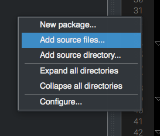
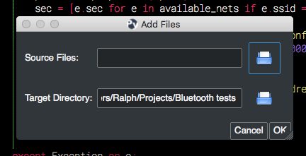
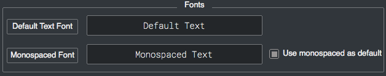
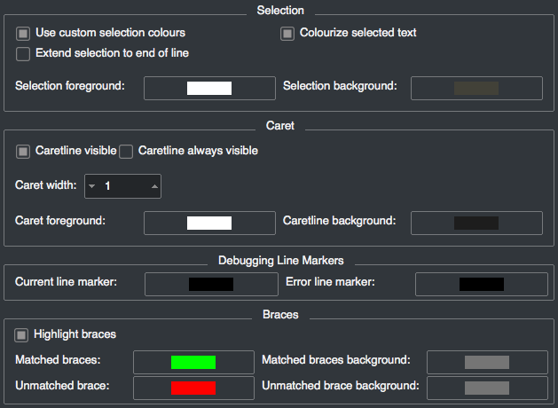
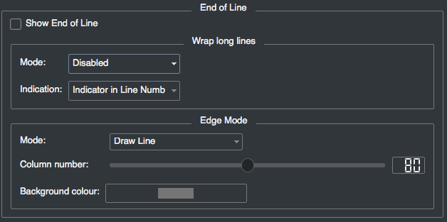
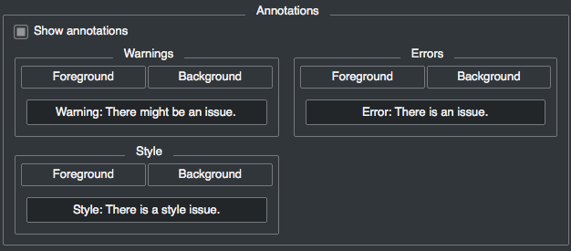

2.7 Pymakr
==========

Here are some basic tips on how to use Pymakr to upload code to your modules. 

Download links:

- `Pymakr download <https://www.pycom.io/solutions/pymakr/>`_.
- `FTDI driver <http://www.ftdichip.com/Drivers/D2XX.htm>`_.

You can find the code on github:

- `Pymakr sourcecode <https://github.com/pycom/Pymakr>`_.
- `Pymakr-kitchen build tool <https://github.com/pycom/Pymakr-kitchen>`_.

So far, one plugin has been created for Pymaker. We hope this list will expand in the future!

- `WakaTime plugin for Pymakr <https://github.com/wakatime/eric6-wakatime/>`_.

Creating a project
------------------

Pymakr has a feature to sync and run your code on your device. This is mostly done 
using projects. The following steps will get you started.

- In Pymakr, go to Project > New project.
- Give it a name and select a folder for your project, either a new of existing one.
- Create two files: main.py and boot.py, if you don't already have those. 

.. note::
    You can also :ref:`use FTP <pycom_filesystem>` to download boot.py and main.py from 
    the board to your project folder, after which you can right-click the project viewer 
    and use the 'add source files' option to add them to your project.

The boot.py file should always have the following code on the top, so we can run our 
python scripts over serial or telnet:

.. code:: python
    
    from machine import UART
    import os
    uart = UART(0, 115200)
    os.dupterm(uart)

Most users, especially WiPy users, would want a wifi script in the boot.py file. 
A basic wifi script but also more advanced WLAN examples, like fixed IP and 
multiple networks, can be found in the :ref:`Wifi Examples <wlan_step_by_step>` chapter. 

Besides the neccesary main.py and boot.py files, you can create any folders and 
python files or libraries that you want to include in your main file. Pymakr 
will synchronize all files in the project to the board when using the sync button. 

Adding files/folders to a project
---------------------------------

If you create any files to your project directory from outside of pymakr, they 
won't appear in your project files. To add them, right-click on the left sidebar 
in the Project-Viewer when you have your project open, and click 'Add source files'.

In the popup that appears, click the folder icon next to the 'Source files' input 
and select one or more files to be included.

Adding a folder works in the exact same way, using the 'Add source directory' after 
right-clicking in the project sidebar. All files inside the chosen directories will 
be added as well.

Without creating a project
--------------------------

If you just want to test some code on the module without creating a Project, 
you can create a new file or open an existing one and press the 'run' button. 

Note that the changes you make to your file won't be automatically saved to 
the device on execution.

Coding basics
-------------

For fun, lets try to build a traffic light. Add the following code to the ``main.py`` file:

::

    import pycom
    import time
    pycom.heartbeat(False)
    for cycles in range(10): # stop after 10 cycles 
        pycom.rgbled(0x007f00) # green
        time.sleep(5)
        pycom.rgbled(0x7f7f00) # yellow
        time.sleep(1.5)
        pycom.rgbled(0x7f0000) # red
        time.sleep(4)

- Make sure the connection to your board is open in the Pycom Console
- Press the sync button on the top toolbar. Any progress will be shown in the console.

Here is the expected result:

.. image:: images/traffic.gif
    :alt: Traffic light
    :align: center
    :scale: 60 %

You now have a traffic light in your hands. To stop a running program, use ctrl-c 
or do a right click on the console and press ``Reset``. You can also reboot 
the board by pressing the physical reset button.

.. Warning::
    If your board is running code at boot time, you might need to boot it in 
    :ref:`safe mode <safeboot>`.

Pycom Console
-------------

To start coding, simply go to the Pycom Console and type your code. Lets try to 
make the LED light up.

.. code:: python

    import pycom # we need this module to control the LED
    pycom.heartbeat(False) # disable the blue blinking
    pycom.rgbled(0x00ff00) # make the LED light up in green color

Change the color by adjusting the hex RGB value

.. code:: python

    pycom.rgbled(0xff0000) # now make the LED light up in red color

The console can be used to run any python code, also functions or loops. Simply 
copy-paste it into the console or type it manually. Note that after writing or 
pasting any indented code like a function or a while loop, you’ll have to press 
enter up to three times to tell MicroPython that you’re closing the code (this 
is standard MicroPython behavior). 

.. image:: images/pymakr-repl-while.png
    :alt: Pymakr REPL while-loop
    :align: center
    :scale: 100 %

Use ``print()`` to output contents of variables to the console for you to read. 
Returned values from functions will also be displayed if they are not caught in 
a variable. This will not happen for code running from the main or boot files. 
Here you need to use ``print()`` to output to the console.

A few pycom-console features you can use:

- ``Input history``: use arrow up and arrow down to scroll through the history
- ``Tab completion``: press tab to auto-complete variables or module names
- ``Stop any running code``: with ctrl-c
- ``Copy/paste code or output``: ctrl-c and ctrl-v (cmd-c and cmd-v for mac)

Connecting your board using Pymakr
----------------------------------

    1. Connect your computer to the WiFi network named after your board (e.g. ``lopy-wlan-xxxx``, ``wipy-wlan-xxxx``). The password is ``www.pycom.io``
    2. Open Pymakr.
    3. In the menu, go to ``Settings > Preferences`` (``Pymakr > Preferences`` on macOS).
    4. In the left list look for Pycom Device.
    5. For device, type down ``192.168.4.1``. The default username and password are ``micro`` and ``python``, respectively.
    6. Click OK

.. note::
    Pymakr also supports wired connections. Instead of typing the IP address, you 
    can click on the combo box arrow and select the proper serial port from the list. 
    Our boards don’t require any username or password for the serial connection, so you
    can leave those fields empty.

.. image:: images/pymakr-wifi-reset.png
    :align: center
    :scale: 50 %
    :alt: Pymakr WiFi settings

That’s it for the first time configuration. In the lower portion of the screen,
you should see the console, with the connection process taking place. At the
end of it, you’ll get a colored ``>>>`` prompt, indicating that you are connected:

.. image:: images/pymakr-repl.png
    :alt: Pymakr REPL
    :align: center
    :scale: 100 %

`There is also a video <https://www.youtube.com/embed/bL5nn2lgaZE>`_ that explains 
these steps on macOS (it is similar for other operating systems):

.. raw:: html

    

    <object style="margin:0 auto;" width="480" height="385"><param name="movie"
    value="https://www.youtube.com/v/bL5nn2lgaZE"></param><param
    name="allowFullScreen" value="true"></param><param
    name="allowscriptaccess" value="always"></param><embed
    src="http://www.youtube.com/v/bL5nn2lgaZE"
    type="application/x-shockwave-flash" allowscriptaccess="always"
    allowfullscreen="true" width="480"
    height="385"></embed></object>
    

Expert interface
----------------

By default, Pymakr is configured in 'lite' interface. In this mode, a lot of features are hidden and only the basic functionality remains. This makes it very user friendly, but after you become familiar with the software, you might want to switch to 'expert' interface to get the most out of Pymakr. 

You can enable expert interface under Settings -> Switch to expert interface. After Pymakr restarts, you'll get access to a few new options:

- Full interface control over tabs and layout
- Control over keyboard shortcuts
- Export/import of preferences
- Preferenes for the editor
- Extra tabs besides the Pycom Console: A local python shell, a task viewer and a basic number converter.
- Bookmarks
- Plugin controls
- Lots of other extra's

To switch back to 'lite' mode, go back to Settings and choose Switch to Lite interface.

Themes and colors
-----------------

Pymakr has 2 default themes: ``Dark`` and ``Light``. To change the basic style, go to Preferences (Pymakr -> Preferences on the left top, or shortkey cmd-,) and head to the ``Interface`` tab. There you'll find a Style property with with both theme options. Press OK or Apply to change to the new theme.

If you are on the Expert interface, the properties screen will also contain an ``Editor`` tab. The second to last sub-tab is named ``Style`` and contains a lot of options regarding colors and fonts. Below the most important options on this page

- Fonts
Change the font of the IDE itself using the 'Default text font' button. The editor and pycom console use the Monospaced font, which is changable with the button below it.

- Margins
The 'margins' box is used to change the properties of the left margin next to the editor. Change the colors, font of the line numbers and the icon for folding.

.. image:: images/pymakr-settings-margins.png
    :align: center
    :scale: 80 %
    :alt: Pymakr margins settings

- Colors
The remainder of the Style page can be used to tweak a lot of colors concerning the editor, like the selection colors, caretline, brace indications, and lots more. 

- End of line features
In this box, you have the option to enable visualisation of line-endings and options for handling long lines. The 'Edge mode' is an indicator for when your lines are too long. The mode and amount of characters for this indicator is configurable here.

- Annotations
Enabling 'Show annotations' can be usefull for debuging, as it adds a bit more info about coding errors in your editor. The colors for the warning, error and style messages can be set individually.

