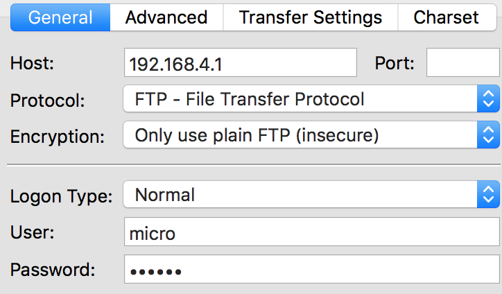

***************************
2. Tools & Features
***************************

2.1 Intro
=========

Do you have your basic setup working? Then it's time to look at all the ways you can use and interact with your board. We'll look at some more features of Pymakr and see how we can use telnet, FTP and how to reset the board.

Contents

- :ref:`2.2 Main features <main_features>`
- :ref:`2.3 REPL over Telnet and Serial <repl>`
- :ref:`2.4 Local file system and FTP access <pycom_filesystem>`
- :ref:`2.5 Boot modes and safe boot <safeboot>`
- :ref:`2.6 Interrupt handling <pycom_interrupt_handling>`
- :ref:`2.7 Pymakr IDE <pymakr_ide>`

.. _main_features:

2.2 Main Features of Pycom Modules
==================================

All members in the current family of Pycom modules are powered by the ESP32, offering:

- 512 Kb available for the user as internal storage, (external SD card support available)
- Up to 96 Kb of RAM available for python code.
- Hardware floating point unit
- Up to 24 GPIO :class:`Pins <.Pin>`
- 2x :class:`UARTs <.UART>`
- :class:`SPIs <.SPI>`
- :class:`Timers <.Timer>`
- :class:`RTC <.RTC>`
- :class:`PWM <.PWM>`
- :class:`ADC <.ADC>`
- :class:`DAC <.DAC>`
- :class:`I2C <.I2C>`
- :class:`SD <.SD>`
- :class:`WiFi <.WLAN>`
- :class:`Bluetooth <.Bluetooth>`
- :class:`LoRa <.LoRa>` (only available in the LoPy)
- :mod:`hashlib <.uhashlib>` MD5, SHA1, SHA256, SHA384 and SHA512 hash algorithms
- :class:`AES encryption <.AES>`
- :mod:`SSL/TLS support <.ussl>``

Click the links in the list above to see more details on that feature.
For all available modules and libraries, please visit the :ref:`Firmware API
Reference <firmware_api_reference>` section.

Datasheets
----------

If you want to find out how things are connected, visit the :ref:`datasheets
section <datasheets>`. Here you'll find the datasheets for all of our products.

.. _repl:

2.3 REPL over Telnet and Serial
===============================

REPL stands for Read Evaluate Print Loop, and is the name given to the interactive MicroPython prompt that you can access on the LoPy. Using the REPL is by far the easiest way to test out your python code and run commands. You can use the REPL in addition to writing scripts in ``main.py``.

.. _pycom_uart:

To use the REPL, you must connect to the LoPy either via ``telnet``,
or with a USB to serial converter wired to one of the two UARTs on the
LoPy. When using the REPL over telnet, authentication is needed. The default credentials are:

- **user:** ``micro``
- **password:** ``python``
See :class:`network.server <.Server>` for info on how to change the defaults.

To enable REPL duplication on UART0 (the one accessible via the expansion board)
do::

   >>> from machine import UART
   >>> import os
   >>> uart = UART(0, 115200)
   >>> os.dupterm(uart)

Place this piece of code inside your `boot.py` so that it's done automatically after
reset. The WiPy 2.0 and LoPy already have this code in the boot.py file by default.

.. note::

   The boards already ship with a **boot.py** file that contains the REPL duplication code.
   In case that you erase it or change, you can enable it back using the lines above.

The following control commands are available in REPL:

- ``Ctrl-A`` on a blank line will enter raw REPL mode. This is like a permanent paste mode, except that characters are not echoed back.
- ``Ctrl-B`` on a blank like goes to normal REPL mode.
- ``Ctrl-C`` cancels any input, or interrupts the currently running code.
- ``Ctrl-D`` on a blank line will do a soft reset.
- ``Ctrl-E`` enters 'paste mode' that allows you to copy and paste chuncks of text. Finish using ``Ctrl-d``

Instructions on how to connect can be found in the two chapters below. A small tutorial on :ref:`how to use the REPL <repl_tutorial>` is available in chapter :ref:`3. Tutorials and Examples`

Mac OS X and Linux
-------------------

Open a terminal and run::

    $ telnet 192.168.4.1

or::

    $ screen /dev/tty.usbmodem* 115200

.. note::

    When using telnet on mac, it takes a while connecting. This is because it's waiting for a reverse dns lookup.

When you are finished and want to exit ``screen``, type CTRL-A CTRL-\\. If your keyboard does not have a \\-key (i.e. you need an obscure combination for \\ like ALT-SHIFT-7) you can remap the ``quit`` command:

- create ``~/.screenrc``
- add ``bind q quit``

This will allow you to quit ``screen`` by hitting CTRL-A Q.

On Linux, you can also try ``picocom`` or ``minicom`` instead of screen.  You may have to
use ``/dev/ttyUSB01`` or a higher number for ``ttyUSB``.  And, you may need to give
yourself the correct permissions to access this devices (eg group ``uucp`` or ``dialout``,
or use sudo).

Windows (PuTTY)
---------------

First you need to install the FTDI drivers for the expansion board's USB to serial
converter. Then you need a terminal software. The best option is to download the
free program PuTTY: `putty.exe <http://www.chiark.greenend.org.uk/~sgtatham/putty/download.html>`_.

**In order to get to the telnet REPL:**

Using putty, select ``Telnet`` as connection type, leave the default port (23)
and enter the IP address of your device (192.168.4.1 when in ``WLAN.AP`` mode),
then click open.

**In order to get to the REPL UART:**

Using your serial program you must connect to the COM port that you found in the
previous step.  With PuTTY, click on "Session" in the left-hand panel, then click
the "Serial" radio button on the right, then enter you COM port (eg COM4) in the
"Serial Line" box.  Finally, click the "Open" button.

.. _pycom_filesystem:

2.4 Local file system and FTP access
====================================

There is a small internal file system (a drive) on the LoPy, called ``/flash``,
which is stored within the external serial flash memory.  If a micro SD card
is hooked-up and mounted, it will be available as well. When the device starts
up, it always boots from the ``boot.py`` located in the ``/flash`` file system.

The file system is accessible via the native FTP server running in the LoPy.
Open your FTP client of choice and connect to:

- **url:** ``ftp://192.168.4.1``
- **user:** ``micro``
- **password:** ``python``

See :class:`network.server <.Server>` for info on how to change the defaults.
The recommended clients are: Linux stock FTP (also on OS X), Filezilla and FireFTP.
For example, on a linux terminal::

   $ ftp 192.168.4.1

The FTP server on the LoPy doesn't support active mode, only passive, therefore,
if using the native unix ftp client, just after logging in do::

    ftp> passive

Keep in mind that the FTP server on the LopY only supports one data connection at a time.
If you are using other FTP Clients check thier documentation to set the maximun allowed
connections accordingly.

FileZilla settings
------------------
Do not use the quick connect button, instead, open the site manager and create a new
configuration. In the ``General`` tab make sure that encryption is set to: ``Only use
plain FTP (insecure)``. In the Transfer Settings tab limit the max number of connections
to one, otherwise FileZilla will try to open a second command connection when retrieving
and saving files, and for simplicity and to reduce code size, only one command and one
data connections are possible. Other FTP clients might behave in a similar way.

.. image:: images/filezilla-settings-2.png
    :alt: Filezilla 1
    :align: center
    :scale: 60 %

.. _safeboot:

2.5 Boot modes and safe boot
============================

If you power up normally, or press the reset button, the LoPy will boot
into standard mode; the ``boot.py`` file will be executed first, then
``main.py`` will run.

You can override this boot sequence by pulling ``P12`` (``G28``) **up** (connect
it to the 3V3 output pin) during reset. This procedure also allows going
back in time to old firmware versions. The LoPy can hold up to 3 different
firmware versions, which are: the factory firmware plus 2 OTA images.

After reset, if ``P12`` is held high, the heartbeat LED will start flashing
slowly in orange color, if after 3 seconds the pin is still being held high,
the LED will start blinking a bit faster and the LoPy will select the previous
OTA image to boot. If the previous user update is the desired firmware image,
``P12`` must be released before 3 more seconds elapse. If after 3 seconds later,
the pin is still high the factory firmware will be selected, the LED will flash
quickly for 1.5 seconds and the LoPy will proceed to boot.
The firmware selection mechanism is as follows:

**Safe Boot Pin** ``P12`` **released during:**

+-------------------------+-------------------------+----------------------------+
| 1st 3 secs window       | 2nd 3 secs window       | Final 1.5 secs window      |
+=========================+=========================+============================+
| | Safe boot, *latest*   | | Safe boot, *previous* | | Safe boot, the *factory* |
| | firmware is selected  | | user update selected  | | firmware is selected     |
+-------------------------+-------------------------+----------------------------+

On all of the above 3 scenarios, safe boot mode is entered, meaning that
the execution of both ``boot.py`` and ``main.py`` is skipped. This is
useful to recover from crash situations caused by the user scripts. The selection
made during safe boot is not persistent, therefore after the next normal reset
the latest firmware will run again.

If you have problems with the filesystem you can :ref:`format the internal flash
drive <pycom_factory_reset>`.

Reset
-----

There are soft resets and hard resets. A soft reset simply clears the state of
the MicroPython virtual machine, but leaves hardware peripherals unaffected. To
do a soft reset, simply press **Ctrl+D** on the REPL, or within a script do::

   >>> import sys
   >>> sys.exit()

A hard reset is the same as performing a power cycle to the board. In order to
hard reset the LoPy, press the switch on the board or::

   >>> import machine
   >>> machine.reset()

.. _pycom_factory_reset:

Factory reset the filesystem
----------------------------

If you device's filesystem gets corrupted (very unlikely, but possible), you
can format it very easily by doing::

   >>> import os
   >>> os.mkfs('/flash')

Resetting the `flash` filesystem deletes all files inside the internal LoPy
storage (not the SD card), and restores the files ``boot.py`` and ``main.py``
back to their original states after the next reset.

.. _pycom_interrupt_handling:

2.6 Interrupt handling
======================

In Pycom's ESP32 MicroPython port there are no restrictions on what you can do within an interrupt handler.
For example, other ports don't allow you to allocate memory inside the handler or use sockets.

These limitations were raised by handling the interrupt events differently. When an interrupt happens,
a message is posted into a queue, notifying a separate thread that the appropriate callback handler should be called.
Such handler would receive an argument. By default it is the object associated with the event.

The programmer can do whatever is needed inside the callback, such as creating new variables,
or even sending network packets. Just keep in mind that interrupts are processed sequentially,
so try to keep the handlers as quick as possible in order to attend them all in a short time.

Currently there are 2 classes supporting interrupts, there the :class:`Alarm <.Alarm>` class and the :class:`Pin <.Pin>`. Both classes provide the ``.callback()`` method that enables the interrupt and registers the given handler. More details about the usage along with examples can be found in their respective sections.

.. note::

    Currently the interrupt system can queue up to 16 interrupts.

.. _pymakr_ide:

.. include:: pymakr.rst
