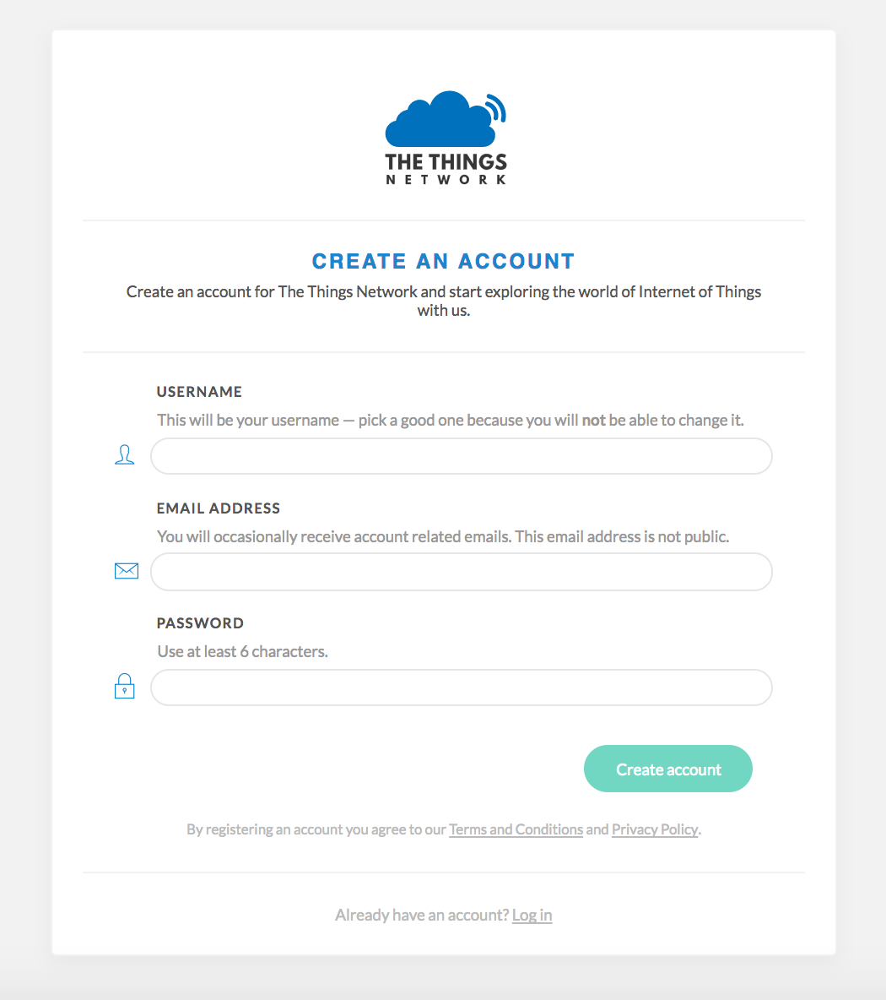
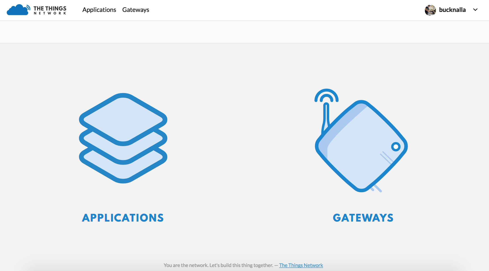
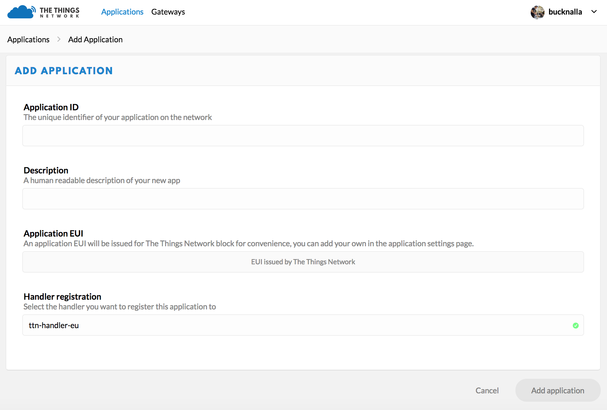
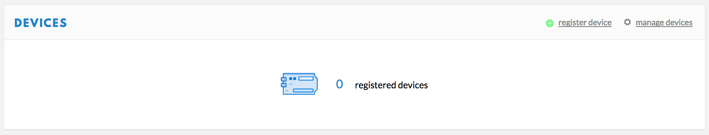
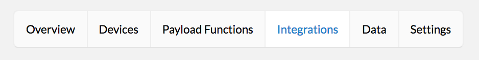
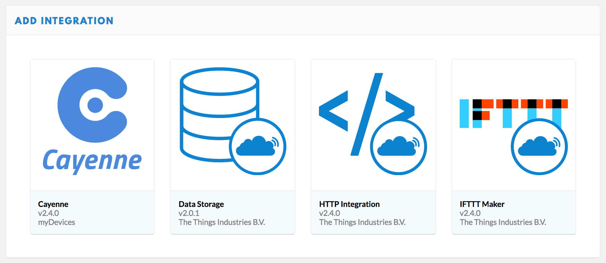
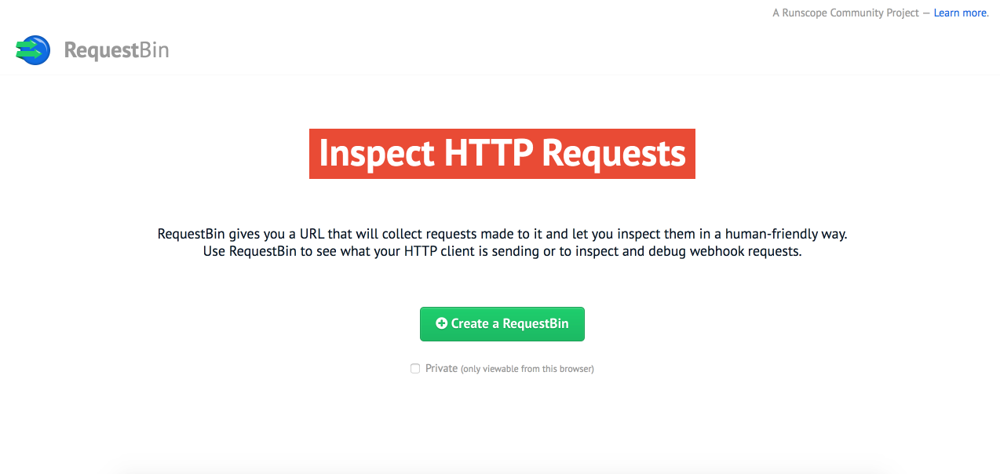

LoRaWAN Nano-Gateway
--------------------

This example allows to connect a LoPy to a LoRaWAN network such as The Things Network (TTN) or Loriot to be used as a nano-gateway.

This specific example uses settings specifically for connecting to TTN within the European 868 MHz region. To set this up for your specific usage, please see the **config.py** file.

Up to date versions of these snippets can be found at the following `GitHub repository <https://github.com/pycom/pycom-libraries/tree/master/examples/lorawan-nano-gateway>`_. For more information and discussion about this code, see this `forum post <https://forum.pycom.io/topic/810/new-firmware-release-1-6-7-b1-lorawan-nano-gateway-with-ttn-example>`_.

Nano-Gateway
============

The Nano-Gateway code is split into 3 files, main.py, config.py and nanogateway.py. These are used to configure and specify how your gateway will connect to your preferred network and how it can act as packet forwarder.

Main (main.py)
^^^^^^^^^^^^^^

This file runs upon bootup and calls the library and config.py files to initalise the nano-gateway. Once configuration is set, the nano-gateway is then started.

::

 """ LoPy LoRaWAN Nano Gateway example usage """

 import config
 from nanogateway import NanoGateway

 nanogw = NanoGateway(id=config.GATEWAY_ID, frequency=config.LORA_FREQUENCY,
                 datarate=config.LORA_DR, ssid=config.WIFI_SSID,
                 password=config.WIFI_PASS, server=config.SERVER,
                 port=config.PORT, ntp=config.NTP, ntp_period=config.NTP_PERIOD_S)

 nanogw.start()

Configuration (config.py)
^^^^^^^^^^^^^^^^^^^^^^^^^

This file contains the specific settings for the server and network it is connecting to. Depending on your region and provide (TTN, Loriot, etc.) these will vary. For specific settings, check the `forum  <https://forum.pycom.io>`_ for others who may have configured their nano-gateway for different configurations.

::

 """ LoPy LoRaWAN Nano Gateway configuration options """

 GATEWAY_ID = '11aa334455bb7788' # specified in when registering your gateway

 SERVER = 'router.eu.thethings.network' # server address & port to forward received data to
 PORT = 1700

 NTP = "pool.ntp.org" # NTP server for getting/setting time
 NTP_PERIOD_S = 3600 # NTP server polling interval

 WIFI_SSID = 'my-wifi'
 WIFI_PASS = 'my-wifi-password'

 LORA_FREQUENCY = 868100000 # check your specifc region for LORA_FREQUENCY and LORA_DR (datarate)
 LORA_DR = "SF7BW125"   # DR_5

Library (nanogateway.py)
^^^^^^^^^^^^^^^^^^^^^^^^

The nano-gateway library controls all of the packet generation and forwarding for the LoRa data. This does not require any user configuration and the latest version of this code should be downloaded from the `Pycom GitHub <https://github.com/pycom/pycom-libraries/tree/master/examples/lorawan-nano-gateway>`_ account.

::

 """ LoPy Nano Gateway class """

 from network import WLAN
 from network import LoRa
 from machine import Timer
 import os
 import binascii
 import machine
 import json
 import time
 import errno
 import _thread
 import socket

 PROTOCOL_VERSION = const(2)

 PUSH_DATA = const(0)
 PUSH_ACK = const(1)
 PULL_DATA = const(2)
 PULL_ACK = const(4)
 PULL_RESP = const(3)

 TX_ERR_NONE = "NONE"
 TX_ERR_TOO_LATE = "TOO_LATE"
 TX_ERR_TOO_EARLY = "TOO_EARLY"
 TX_ERR_COLLISION_PACKET = "COLLISION_PACKET"
 TX_ERR_COLLISION_BEACON = "COLLISION_BEACON"
 TX_ERR_TX_FREQ = "TX_FREQ"
 TX_ERR_TX_POWER = "TX_POWER"
 TX_ERR_GPS_UNLOCKED = "GPS_UNLOCKED"

 STAT_PK = {"stat": {"time": "", "lati": 0,
                    "long": 0, "alti": 0,
                    "rxnb": 0, "rxok": 0,
                    "rxfw": 0, "ackr": 100.0,
                    "dwnb": 0, "txnb": 0}}

 RX_PK = {"rxpk": [{"time": "", "tmst": 0,
                   "chan": 0, "rfch": 0,
                   "freq": 868.1, "stat": 1,
                   "modu": "LORA", "datr": "SF7BW125",
                   "codr": "4/5", "rssi": 0,
                   "lsnr": 0, "size": 0,
                   "data": ""}]}

 TX_ACK_PK = {"txpk_ack":{"error":""}}

 class NanoGateway:

     def __init__(self, id, frequency, datarate, ssid, password, server, port, ntp='pool.ntp.org', ntp_period=3600):
	     self.id = id
         self.frequency = frequency
         self.sf = self._dr_to_sf(datarate)
         self.ssid = ssid
         self.password = password
         self.server = server
         self.port = port
         self.ntp = ntp
         self.ntp_period = ntp_period

         self.rxnb = 0
         self.rxok = 0
		 self.rxfw = 0
		 self.dwnb = 0
		 self.txnb = 0

         self.stat_alarm = None
		 self.pull_alarm = None
		 self.uplink_alarm = None

         self.udp_lock = _thread.allocate_lock()

         self.lora = None
         self.lora_sock = None

     def start(self):
         # Change WiFi to STA mode and connect
         self.wlan = WLAN(mode=WLAN.STA)
         self._connect_to_wifi()

         # Get a time Sync
         self.rtc = machine.RTC()
         self.rtc.ntp_sync(self.ntp, update_period=self.ntp_period)

         # Get the server IP and create an UDP socket
         self.server_ip = socket.getaddrinfo(self.server, self.port)[0][-1]
         self.sock = socket.socket(socket.AF_INET, socket.SOCK_DGRAM, socket.IPPROTO_UDP)
         self.sock.setsockopt(socket.SOL_SOCKET, socket.SO_REUSEADDR, 1)
         self.sock.setblocking(False)

         # Push the first time immediatelly
         self._push_data(self._make_stat_packet())

         # Create the alarms
         self.stat_alarm = Timer.Alarm(handler=lambda t: self._push_data(self._make_stat_packet()), s=60, periodic=True)
         self.pull_alarm = Timer.Alarm(handler=lambda u: self._pull_data(), s=25, periodic=True)

         # Start the UDP receive thread
         _thread.start_new_thread(self._udp_thread, ())

         # Initialize LoRa in LORA mode
         self.lora = LoRa(mode=LoRa.LORA, frequency=self.frequency, bandwidth=LoRa.BW_125KHZ, sf=self.sf,
                         preamble=8, coding_rate=LoRa.CODING_4_5, tx_iq=True)
         # Create a raw LoRa socket
         self.lora_sock = socket.socket(socket.AF_LORA, socket.SOCK_RAW)
         self.lora_sock.setblocking(False)
         self.lora_tx_done = False

         self.lora.callback(trigger=(LoRa.RX_PACKET_EVENT | LoRa.TX_PACKET_EVENT), handler=self._lora_cb)

     def stop(self):
         # TODO: Check how to stop the NTP sync
         # TODO: Create a cancel method for the alarm
         # TODO: kill the UDP thread
         self.sock.close()

     def _connect_to_wifi(self):
         self.wlan.connect(self.ssid, auth=(None, self.password))
         while not self.wlan.isconnected():
             time.sleep(0.5)
         print("WiFi connected!")

     def _dr_to_sf(self, dr):
         sf = dr[2:4]
         if sf[1] not in '0123456789':
             sf = sf[:1]
         return int(sf)

     def _sf_to_dr(self, sf):
         return "SF7BW125"

     def _make_stat_packet(self):
         now = self.rtc.now()
         STAT_PK["stat"]["time"] = "%d-%02d-%02d %02d:%02d:%02d GMT" % (now[0], now[1], now[2], now[3], now[4], now[5])
         STAT_PK["stat"]["rxnb"] = self.rxnb
         STAT_PK["stat"]["rxok"] = self.rxok
         STAT_PK["stat"]["rxfw"] = self.rxfw
         STAT_PK["stat"]["dwnb"] = self.dwnb
         STAT_PK["stat"]["txnb"] = self.txnb
         return json.dumps(STAT_PK)

     def _make_node_packet(self, rx_data, rx_time, tmst, sf, rssi, snr):
         RX_PK["rxpk"][0]["time"] = "%d-%02d-%02dT%02d:%02d:%02d.%dZ" % (rx_time[0], rx_time[1], rx_time[2], rx_time[3], rx_time[4], rx_time[5], rx_time[6])
         RX_PK["rxpk"][0]["tmst"] = tmst
         RX_PK["rxpk"][0]["datr"] = self._sf_to_dr(sf)
         RX_PK["rxpk"][0]["rssi"] = rssi
         RX_PK["rxpk"][0]["lsnr"] = float(snr)
         RX_PK["rxpk"][0]["data"] = binascii.b2a_base64(rx_data)[:-1]
         RX_PK["rxpk"][0]["size"] = len(rx_data)
         return json.dumps(RX_PK)

     def _push_data(self, data):
         token = os.urandom(2)
         packet = bytes([PROTOCOL_VERSION]) + token + bytes([PUSH_DATA]) + binascii.unhexlify(self.id) + data
         with self.udp_lock:
             try:
                 self.sock.sendto(packet, self.server_ip)
             except Exception:
                 print("PUSH exception")

     def _pull_data(self):
         token = os.urandom(2)
         packet = bytes([PROTOCOL_VERSION]) + token + bytes([PULL_DATA]) + binascii.unhexlify(self.id)
         with self.udp_lock:
             try:
                 self.sock.sendto(packet, self.server_ip)
             except Exception:
                 print("PULL exception")

     def _ack_pull_rsp(self, token, error):
         TX_ACK_PK["txpk_ack"]["error"] = error
         resp = json.dumps(TX_ACK_PK)
         packet = bytes([PROTOCOL_VERSION]) + token + bytes([PULL_ACK]) + binascii.unhexlify(self.id) + resp
         with self.udp_lock:
             try:
                 self.sock.sendto(packet, self.server_ip)
             except Exception:
                 print("PULL RSP ACK exception")

     def _lora_cb(self, lora):
         events = lora.events()
         if events & LoRa.RX_PACKET_EVENT:
             self.rxnb += 1
             self.rxok += 1
             rx_data = self.lora_sock.recv(256)
             stats = lora.stats()
             self._push_data(self._make_node_packet(rx_data, self.rtc.now(), stats.timestamp, stats.sf, stats.rssi, stats.snr))
             self.rxfw += 1
         if events & LoRa.TX_PACKET_EVENT:
             self.txnb += 1
             lora.init(mode=LoRa.LORA, frequency=self.frequency, bandwidth=LoRa.BW_125KHZ,
                      sf=self.sf, preamble=8, coding_rate=LoRa.CODING_4_5, tx_iq=True)

     def _send_down_link(self, data, tmst, datarate, frequency):
         self.lora.init(mode=LoRa.LORA, frequency=frequency, bandwidth=LoRa.BW_125KHZ,
                       sf=self._dr_to_sf(datarate), preamble=8, coding_rate=LoRa.CODING_4_5,
                       tx_iq=True)
         while time.ticks_us() < tmst:
             pass
         self.lora_sock.send(data)

     def _udp_thread(self):
         while True:
             try:
                 data, src = self.sock.recvfrom(1024)
                 _token = data[1:3]
                 _type = data[3]
                 if _type == PUSH_ACK:
                     print("Push ack")
                 elif _type == PULL_ACK:
                     print("Pull ack")
                 elif _type == PULL_RESP:
                     self.dwnb += 1
                     ack_error = TX_ERR_NONE
                     tx_pk = json.loads(data[4:])
                     tmst = tx_pk["txpk"]["tmst"]
                     t_us = tmst - time.ticks_us() - 5000
                     if t_us < 0:
                         t_us += 0xFFFFFFFF
                     if t_us < 20000000:
                         self.uplink_alarm = Timer.Alarm(handler=lambda x: self._send_down_link(binascii.a2b_base64(tx_pk["txpk"]["data"]),
                                                                                               tx_pk["txpk"]["tmst"] - 10, tx_pk["txpk"]["datr"],
                                                                                               int(tx_pk["txpk"]["freq"] * 1000000)), us=t_us)
                     else:
                         ack_error = TX_ERR_TOO_LATE
                         print("Downlink timestamp error!, t_us:", t_us)
                     self._ack_pull_rsp(_token, ack_error)
                     print("Pull rsp")
             except socket.timeout:
                 pass
             except OSError as e:
                 if e.errno == errno.EAGAIN:
                     pass
                 else:
                     print("UDP recv OSError Exception")
             except Exception:
                 print("UDP recv Exception")
             # Wait before trying to receive again
             time.sleep(0.025)

Registering with TTN
====================

To set up the gateway with The Things Network (TTN), navigate to their `website  <https://www.thethingsnetwork.org/>`_ and create/register an account. You will need to enter a username and an email address to verify your account on their platform.

Once you've registered an account, you can then start the process of registering your nano-gateway. To do this you'll need to navigate to the TTN Console web page.

Registering the Gateway
^^^^^^^^^^^^^^^^^^^^^^^

Inside the TTN Console, you'll have two options, ``applications`` and ``gateways``. Select gateways and then click on ``register gateway``. This will allow you to set up and register a new nano-gateway.

On the ``Register Gateway`` page, you will need to set the following settings.

.. image:: images/ttn-3.png
    :alt: Gateway Settings
    :align: center
    :scale: 40 %

These are unique to your gateway, location and country defined frequency. Please verify that you have the correct settings otherwise the gateway will not connect to TTN.

+------------------------+-----------------------------------------+
| Option                 | Value                                   |
+========================+=========================================+
| Protocol               | Packet Forwarder                        |
+------------------------+-----------------------------------------+
| Gateway EUI            | *User Defined* (must match config.py)   |
+------------------------+-----------------------------------------+
| Description            | *User Defined*                          |
+------------------------+-----------------------------------------+
| Frequency Plan         | Select Country (e.g. EU - 868 MHz)      |
+------------------------+-----------------------------------------+
| Location               | *User Defined*                          |
+------------------------+-----------------------------------------+
| Antenna Placement      | Indoor or Outdoor                       |
+------------------------+-----------------------------------------+

Once the settings have been applied, click ``Register Gateway``. At this point you'll arrive at a ``Gateway Overview`` page where your configuration settings will be visible. Next click on the ``Gateway Settings`` and configure the ``Router`` address to match that of your gateway (default - **router.eu.thethings.network**).

.. image:: images/ttn-4.png
    :alt: Gateway Settings
    :align: center
    :scale: 40 %

The ``Gateway`` should now be configured. Next one or more nodes can now be configured to use the nano-gateway and TTN applications may be built.

LoPy Node
=========

There are two methods of connecting LoPy devices to the nano-gateway, Over the Air Activation (**OTAA**) and Activation By Personalisation (**ABP**). The code and instructions for registering these methods are shown below, followed by instruction for how to connect them to an application on TTN.

.. warning::

	It's important that the **following code examples** (also on `GitHub  <https://github.com/pycom/pycom-libraries/blob/master/examples/lorawan-nano-gateway>`_) are used to connect to the nano-gateway as it only supports single channel connections.

OTAA (Over The Air Activation)
^^^^^^^^^^^^^^^^^^^^^^^^^^^^^^

When the LoPy connects an application (via TTN) using OTAA, the network configuration is derived automatically during a handshake between the LoPy and network server.
Note that the network keys derived using the OTAA methodology are specific to the device and are used to encrypt and verify transmissions at the network level.

::

 """ OTAA Node example compatible with the LoPy Nano Gateway """

 from network import LoRa
 import socket
 import binascii
 import struct
 import time

 # Initialize LoRa in LORAWAN mode.
 lora = LoRa(mode=LoRa.LORAWAN)

 # create an OTA authentication params
 dev_eui = binascii.unhexlify('AA BB CC DD EE FF 77 78'.replace(' ','')) # these settings can be found from TTN
 app_eui = binascii.unhexlify('70 B3 D5 7E F0 00 3B FD'.replace(' ','')) # these settings can be found from TTN
 app_key = binascii.unhexlify('36 AB 76 25 FE 77 77 68 81 68 3B 49 53 00 FF D6'.replace(' ','')) # these settings can be found from TTN

 # set the 3 default channels to the same frequency (must be before sending the OTAA join request)
 lora.add_channel(0, frequency=868100000, dr_min=0, dr_max=5)
 lora.add_channel(1, frequency=868100000, dr_min=0, dr_max=5)
 lora.add_channel(2, frequency=868100000, dr_min=0, dr_max=5)

 # join a network using OTAA
 lora.join(activation=LoRa.OTAA, auth=(dev_eui, app_eui, app_key), timeout=0)

 # wait until the module has joined the network
 while not lora.has_joined():
     time.sleep(2.5)
     print('Not joined yet...')

 # remove all the non-default channels
 for i in range(3, 16):
     lora.remove_channel(i)

 # create a LoRa socket
 s = socket.socket(socket.AF_LORA, socket.SOCK_RAW)

 # set the LoRaWAN data rate
 s.setsockopt(socket.SOL_LORA, socket.SO_DR, 5)

 # make the socket blocking
 s.setblocking(False)

 time.sleep(5.0)

 """ Your own code can be written below! """

 for i in range (200):
     s.send(b'PKT #' + bytes([i]))
     time.sleep(4)
     rx = s.recv(256)
     if rx:
         print(rx)
     time.sleep(6)

ABP (Activation By Personalisation)
^^^^^^^^^^^^^^^^^^^^^^^^^^^^^^^^^^^

Using ABP join mode requires the user to define the following values and input them into both the LoPy and the TTN Application:

- Device Address
- Application Session Key
- Network Session Key

::

 """ ABP Node example compatible with the LoPy Nano Gateway """

 from network import LoRa
 import socket
 import binascii
 import struct
 import time

 # Initialize LoRa in LORAWAN mode.
 lora = LoRa(mode=LoRa.LORAWAN)

 # create an ABP authentication params
 dev_addr = struct.unpack(">l", binascii.unhexlify('26 01 14 7D'.replace(' ','')))[0] # these settings can be found from TTN
 nwk_swkey = binascii.unhexlify('3C74F4F40CAE2221303BC24284FCF3AF'.replace(' ','')) # these settings can be found from TTN
 app_swkey = binascii.unhexlify('0FFA7072CC6FF69A102A0F39BEB0880F'.replace(' ','')) # these settings can be found from TTN

 # join a network using ABP (Activation By Personalization)
 lora.join(activation=LoRa.ABP, auth=(dev_addr, nwk_swkey, app_swkey))

 # remove all the non-default channels
 for i in range(3, 16):
     lora.remove_channel(i)

 # set the 3 default channels to the same frequency
 lora.add_channel(0, frequency=868100000, dr_min=0, dr_max=5)
 lora.add_channel(1, frequency=868100000, dr_min=0, dr_max=5)
 lora.add_channel(2, frequency=868100000, dr_min=0, dr_max=5)

 # create a LoRa socket
 s = socket.socket(socket.AF_LORA, socket.SOCK_RAW)

 # set the LoRaWAN data rate
 s.setsockopt(socket.SOL_LORA, socket.SO_DR, 5)

 # make the socket blocking
 s.setblocking(False)

 """ Your own code can be written below! """

 for i in range (200):
     s.send(b'PKT #' + bytes([i]))
     time.sleep(4)
     rx = s.recv(256)
     if rx:
         print(rx)
     time.sleep(6)

TTN Applications
================

Now that the gateway & nodes have been setup, you can then build a TTN Application; i.e. what happens to your LoRa data once it is received by TTN. There are a number of different setups/systems you can use however, the following example demonstrates the HTTP request integration.

Registering an Application
^^^^^^^^^^^^^^^^^^^^^^^^^^

Selecting the ``Applications`` tab at the top of the TTN console will bring you to a screen for registering applications. Click register and a new page, similar to the one below, will open.

Enter a unique ``Application ID`` as well as a Description & Handler Registration.

You'll now need to register your LoPy nodes to send data up to the new Application, you just registered.

Registering Devices (LoPy)
^^^^^^^^^^^^^^^^^^^^^^^^^^

To connect your nodes to the nano-gateway, you'll need to add some devices to your application. To do this, navigate to the ``Devices`` tab on the ``Application`` home page and click the ``Register Device`` button.

In the ``Register Device`` panel, you'll need to complete the forms for the ``Device ID`` and the ``Device EUI``. The ``Device ID`` is user specified and is unique to the device in this application. The ``Device EUI`` is also user specified but must consist of exactly 8 bytes, given in hexadecimal.

Once the device has been added, you'll be able to change the ``Activation Method`` between ``OTAA`` and ``ABP`` depending on your preference. This option can be found under the ``Settings`` tab.

.. info::

	You'll find the ``Device EUI``,``App EUI``, ``App Key`` and other settings required for your node's ``main.py`` file. Check the earlier section for information on which details your node requires (``OTAA`` or ``ABP``).

Adding Application Integrations
^^^^^^^^^^^^^^^^^^^^^^^^^^^^^^^

Now that your data is arriving on the TTN Backend, you will now want to manage where TTN sends your data on to. To do this, we will use the ``Integrations`` tab within the new Application's settings.

Upon clicking ``add integration``, you'll be presented with 4 different options. These have various functionality and more information about them can be found on the TTN website/documentation.

We'll be using the ``HTTP Integration`` to forward our LoRaWAN Packets to a remote server/address.

Click ``HTTP Integration`` to connect up an endpoint that can receive your data.

For testing, we can use a website called `RequestBin  <https://requestb.in>`_ to receive the data that TTN forwards (via POST Request). To set this up, navigate to `RequestBin  <https://requestb.in>`_ and click the ``Create a RequestBin``.

Copy the URL that is generated and past this into the ``URL`` form under the ``Application Settings``.

.. image:: images/ttn-8.png
    :alt: Integration Settings
    :align: center
    :scale: 40 %

This is the address that TTN will forward your data onto. As soon as your LoPy starts sending messages, TTN will forward these onto ``RequestBin`` and you will see them appear at your unique RequestBin URL.
