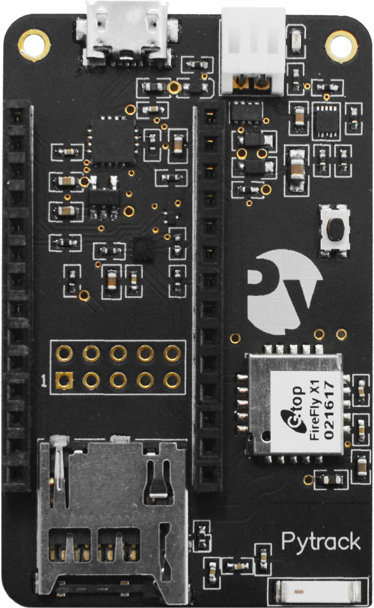

.. _pytrack_start:

Pytrack
=======

Pytrack is a location enabled version of the Expansion Board, intended for use in GPS applications such as asset tracking or monitoring.

.. _pytrack_hardware:

Features & Hardware
-------------------

The Pytrack is has a number of features including GPS, 3-Axis Accelerometer and Battery Charger. See the list below for detailed specifics about each sensor, including datasheets.

- USB Serial Converter
- 3-Axis Accelerometer (:download:`LIS2HH12 <datasheets/LIS2HH12.pdf>`)
- Battery Charger (:download:`BQ24040 <datasheets/BQ24040.pdf>` with JST connector)
- GPS and GLONASS (:download:`L76-L <datasheets/QuectelL76-LGNSS.pdf>`)
- MicroSD Card Reader

All of the included sensors are connected to the Pycom device via the I2C interface. These pins are located at **P22** (SDA) and **P21** (SCL).

.. _pytrack_getting_started:

Getting Started
---------------

Using the Pytrack is the same as connecting an external library to your Pycom device. You'll need to upload the required libraries to your device, prior to using the Pytrack's sensors. The latest version of these libraries are available at `Pycom Libraries <https://github.com/pycom/pycom-libraries>`_.

1. Navigate to `Pycom Libraries <https://github.com/pycom/pycom-libraries>`_
2. Select the the library for the sensor you wish to use
3. Download the .py file (e.g. lis2hh12.py) by clicking *Clone or download*, then *Download ZIP*
4. Extract the ZIP file
5. Upload the library file to your Pycom device

With the Pytrack Libary downloaded, this can be uploaded to a Pycom device either via `FTP <https://docs.pycom.io/pycom_esp32/pycom_esp32/toolsandfeatures.html#local-file-system-and-ftp-access>`_ or using the `Pymakr Plugin Sync <https://docs.pycom.io/pycom_esp32/pycom_esp32/toolsandfeatures.html#pymakr-plugin>`_ feature. You can connect to the Pytrack over USB Serial via Pymakr Plugin or another USB Serial Tool (E.g. Putty).

Ensure that these are placed into the ``lib`` folder within the device's file storage.

.. image:: images/pysense-ftp.png
    :alt: Pytrack FTP
    :align: center
    :scale: 50 %

Once the library file is uploaded to your device, the library can be imported into a main.py script or run from the REPL. Below are two examples of importing the 3-Axis Accelerometer Libraries, both from main.py as well as the REPL.

**main.py**

::

 from lis2hh12 import LIS2HH12

**REPL**

::

 >>> from lis2hh12 import LIS2HH12

Connecting a Pycom device to the Pytrack, is the same process as connecting it to the Expansion Board. Align the LoPy, WiPy, etc. with the USB connector and securely press the Pycom device into the Pytrack.

For getting started examples, see the :ref:`Examples <pytrack_examples>`. For API & library reference, see :ref:`API Reference <pytrack_ref>`.
