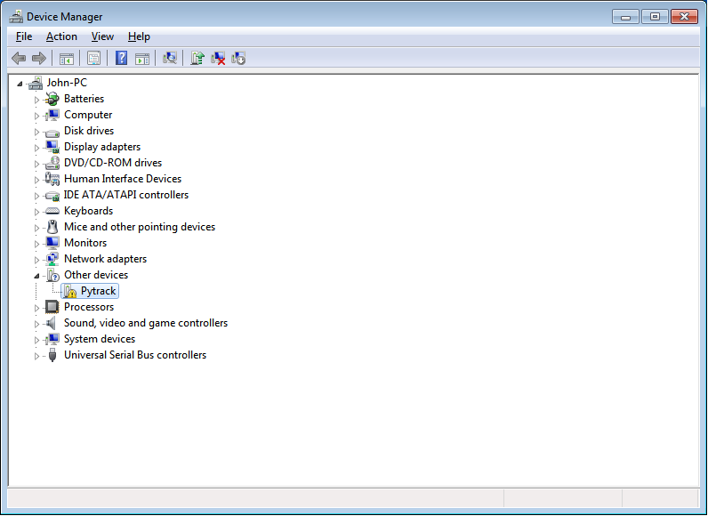
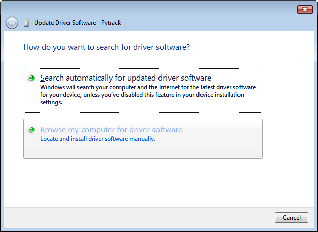
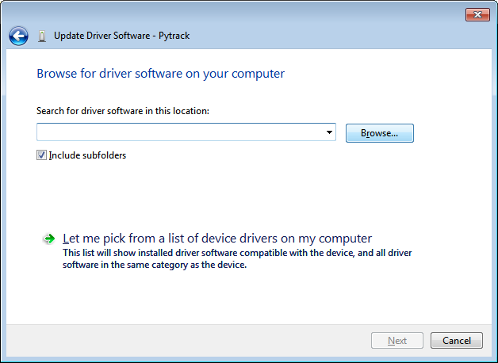
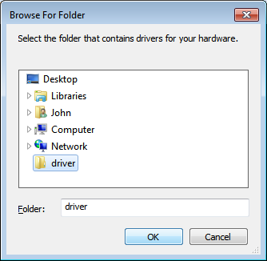
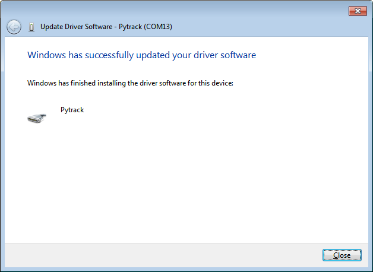
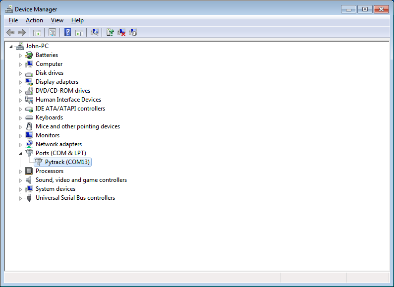

.. _windows_7_driver:

Windows 7 Driver
================

Pytrack and Pysense will work out of the box for Windows 8/10/+, Mac OS as well as Linux. If you are using Windows 7, you will need to install the following drivers to start using the board.

Please follow the instructions below to install the required drivers.

Download
--------

Please download the driver software from the link below.

:download:`Download Driver<downloads/pycom.inf>`

Installation
------------

First navigate open the Windows start menu and search/navigate to ``Device Manager``. You should see your Pytrack/Pysense in the dropdown under **other devices**.

Right click the device and select ``Update Driver Software``.

.. image:: images/win7-2.png
    :alt: Win7 2
    :align: center
    :scale: 60 %

Select the option to **Browse my computer for driver software**.

Next you will need to navigate to where you downloaded the driver to (e.g. **Downloads** Folder).

Specify the folder in which the drivers are contained. If you haven't extracted the .zip file, please do this before selecting the folder.

You may receive a warning, suggesting that windows can't verify the publisher of this driver. Click ``Install this driver software anyway`` as this link points to our official driver.

.. image:: images/win7-6.png
    :alt: Win7 6
    :align: center
    :scale: 60 %

If the installation was successful, you should now see a window specifying that the driver was correctly installed.

To confirm that the installation was correct, navigate back to the ``Device Manager`` and click the dropdown for other devices. The warning label should now be gone and Pytrack/Pysense should be installed.

